# Automated Pickup Service

Built by Jun Alvior.

A professional, high-performance web application designed to streamline inventory management and order fulfillment for local businesses. This system leverages Google Sheets as a lightweight, real-time database, Firebase for secure authentication, and event-driven automation for customer notifications.



## Features

- **Public Inventory**: A read-only product catalog pulled directly from Google Sheets, allowing anyone to browse without logging in.
- **Secure Authentication**: Firebase Auth integration supporting Email/Password and Google SSO for customer accounts.
- **Order Management**: Seamless ordering process for authenticated users with real-time status tracking.
- **Admin Dashboard**: Dedicated interface for store owners to manage pending orders and update fulfillment status.
- **Automated Notifications**: Event-driven email alerts via Resend when orders are placed and when they are ready for pickup.
- **Premium UI**: Built with a modern glassmorphic aesthetic using Tailwind CSS 4, Framer Motion, and Anime.js for fluid interactions.

## Tech Stack

- **Frontend**: [React](https://reactjs.org/) + [Vite](https://vitejs.dev/)
- **Styling**: [Tailwind CSS 4](https://tailwindcss.com/) + [Framer Motion](https://www.framer.com/motion/) + [Anime.js](https://animejs.com/)
- **Authentication**: [Firebase Auth](https://firebase.google.com/docs/auth)
- **Database/Storage**: [Google Sheets API](https://developers.google.com/sheets/api) (via `google-spreadsheet`)
- **Backend**: [Vercel Serverless Functions](https://vercel.com/docs/functions)
- **Emails**: [Resend](https://resend.com/)

## Setup & Installation

### 1. Prerequisites
- Node.js (v18 or higher)
- A Google Cloud Project with Sheets API enabled
- A Firebase Project
- A Resend API Key

### 2. Clone the Repository
```bash
git clone https://github.com/your-username/automation-pick-up-service.git
cd automation-pick-up-service
```

### 3. Install Dependencies
```bash
npm install
```

### 4. Environment Configuration
Create a `.env.local` file in the root directory and populate it with your credentials (refer to `.env.example` for the full list):

```env
# Google Sheets
GOOGLE_SERVICE_ACCOUNT_EMAIL=...
GOOGLE_PRIVATE_KEY="..."
GOOGLE_SHEET_ID=...

# Firebase
VITE_FIREBASE_API_KEY=...
VITE_FIREBASE_AUTH_DOMAIN=...
VITE_FIREBASE_PROJECT_ID=...

# Email
RESEND_API_KEY=...
```

> [!IMPORTANT]
> Follow the detailed [Google Sheets Setup Guide](./GOOGLE_SHEETS_GUIDE.md) to correctly configure your service account and spreadsheet permissions.

### 5. Run Locally
```bash
npm run dev
```

## Architecture

The system operates on four technology pillars:
1.  **Identity**: Managed by Firebase Auth.
2.  **Public Catalog**: Fetched directly from Google Sheets for easy updates by non-technical staff.
3.  **Order Flow**: Orders are captured in Google Sheets, which serves as the primary source of truth.
4.  **Automation**: Serverless functions trigger email workflows based on order state changes.

## License

This project is free and open source. You are free to copy, modify, and use this system as long as you can fully set it up and configure it for your own needs.

---

Built by Jun Alvior for local businesses.